# 基于西安出租车GPS轨迹数据的轨迹修复与行程时间估计

---

## 目录

1. [项目概述](#1-项目概述)
2. [数据说明与探索性分析](#2-数据说明与探索性分析)
3. [任务B：行程时间估计（TTE）](#3-任务b行程时间估计tte)
   - 3.1 [问题定义](#31-问题定义)
   - 3.2 [方法论设计](#32-方法论设计)
   - 3.3 [实验结果与分析](#33-实验结果与分析)
   - 3.4 [迭代历程与讨论](#34-迭代历程与讨论)
4. [任务A：轨迹修复（Trajectory Recovery）](#4-任务a轨迹修复trajectory-recovery)
   - 4.1 [问题定义](#41-问题定义)
   - 4.2 [Baseline 1：线性插值](#42-baseline-1线性插值)
   - 4.3 [Baseline 2：路网约束修复](#43-baseline-2路网约束修复)
   - 4.4 [Baseline 2.3：HMM-Viterbi路网约束修复](#44-baseline-23hmm-viterbi路网约束修复)
   - 4.5 [从 recovery 到 final 的迭代收束](#45-从-task_a_recovery-到-task_a_final-的迭代收束)
   - 4.6 [统一分析框架](#46-统一分析框架从单版本图表升级到统一分析--纵向分析)
   - 4.7 [纵向分析](#47-纵向分析baseline-到-final-的统一对比)
   - 4.8 [分析框架升级的意义](#48-本轮分析框架升级的意义)
5. [总结与展望](#5-总结与展望)
6. [参考文献](#6-参考文献)
7. [附录A：历史交互式标注与评价框架反思](#附录a历史交互式标注与评价框架反思bl28阶段补充)

---

## 1 项目概述

本项目基于2016年10月中国西安市出租车GPS轨迹数据，完成两个独立子任务：

- **任务A（Trajectory Recovery，轨迹修复）**：给定稀疏采样的出租车轨迹（保留率分别为1/8和1/16），恢复被删除的中间点坐标。
- **任务B（Travel Time Estimation，行程时间估计）**：给定完整的行驶路径坐标和出发时刻，预测总行程耗时。

两项任务均涉及时空数据的建模与恢复问题。在学术层面，Task A属于**稀疏轨迹补全（Sparse Trajectory Completion）**或**轨迹修复（Trajectory Recovery）**范畴；Task B属于**行程时间估计（Travel Time Estimation, TTE）**或**到达时间预测（Estimated Time of Arrival, ETA）**范畴。

**本报告在结构上采用“先 Task B、后 Task A”的展开顺序。** 这样安排并非因为 Task B 更重要，而是因为 **Task B 的方法链更短、结果更早收敛，适合作为全文的低门槛入口；Task A 则是本项目的核心工作，方法迭代更长、分析层次更多，需要放在后半部分集中展开。** 因此，读者可以先通过 Task B 快速建立对数据、建模方式与实验口径的整体认识，再进入 Task A 的主线：从 recovery 阶段的多轮探索，到 `task_A_final` 中面向指标冲刺的定版收束。历史性交互式标注实验与多框架反思不再作为正文主线，而是压缩为附录，用来解释为什么 final 分析中需要引入路径形状相似度指标。

---

## 2 数据说明与探索性分析

### 2.1 数据来源

| 属性         | 值                   |
| ------------ | -------------------- |
| 城市         | 中国西安             |
| 时间范围     | 2016年10月（整月）   |
| 坐标系       | WGS-84（经度, 纬度） |
| 原始采样间隔 | 约3秒                |
| 降采样间隔   | 约15秒               |
| 轨迹点数范围 | 50 ~ 240 点/条       |
| 轨迹时长范围 | 约10 ~ 68 分钟       |

训练集包含132,657条轨迹，验证集包含16,582条轨迹。`data_org`为原始采样率数据，`data_ds15`为降采样至约15秒间隔的数据。测试数据基于`data_ds15`生成。

### 2.2 Task A 数据特征

Task A的输入为经过人为稀疏化的轨迹：每条轨迹原本有$N$个等间隔（约15秒）的GPS点，保留点仍有真实坐标，待预测点的坐标被设为NaN；模型需要将这些NaN位置恢复为完整经纬度坐标。

| 难度级别 | 文件               | 保留率 | 说明              |
| -------- | ------------------ | ------ | ----------------- |
| 简单     | `val_input_8.pkl`  | 1/8    | 约每8个点保留1个  |
| 困难     | `val_input_16.pkl` | 1/16   | 约每16个点保留1个 |

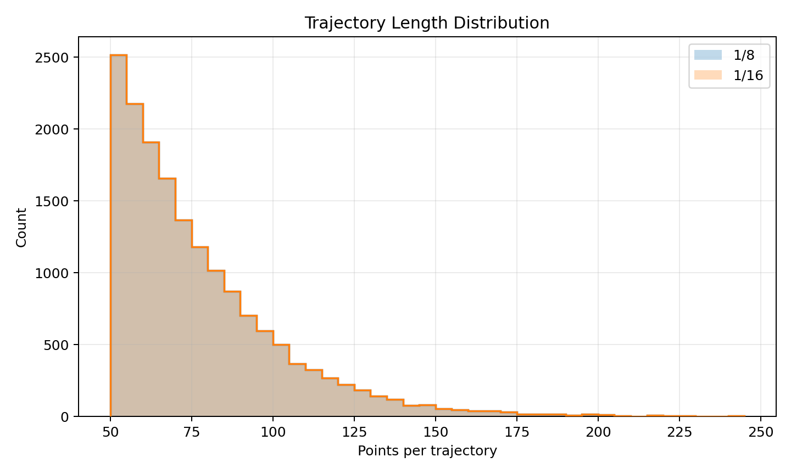

*图2-1 两种难度下验证集轨迹长度分布*

从图2-1可见，1/8和1/16两种数据集的轨迹长度分布形态一致，峰值均出现在100~150点区间，符合城市出租车典型行程长度特征。

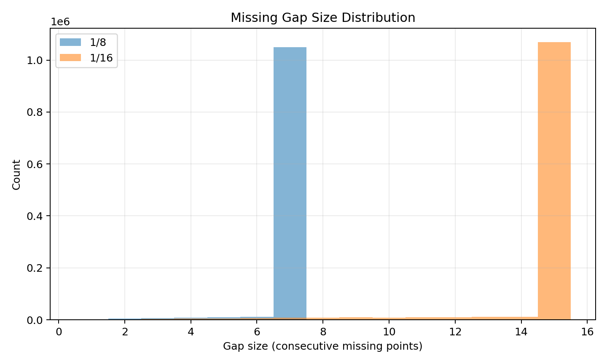

*图2-2 缺失gap大小分布*

图2-2展示了连续缺失点的数量（gap size）分布。在1/8保留率下，缺失gap主要分布在1~7之间；在1/16保留率下，gap显著增大，大量gap超过8个点甚至达到15+。这直接决定了不同gap长度策略的必要性。

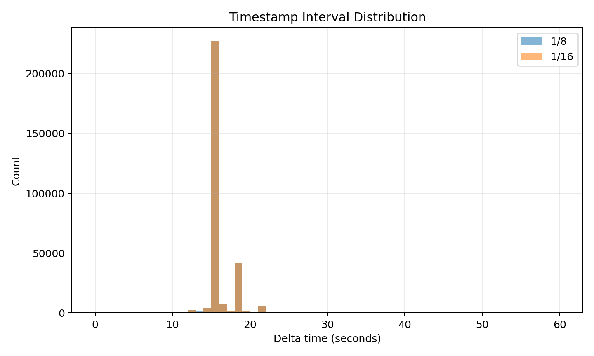

*图2-3 时间戳间隔分布*

图2-3表明相邻采样点的时间间隔高度集中在15秒附近（降采样目标间隔），存在少量偏差，整体采样规律性强。

### 2.3 Task B 数据特征

Task B的输入为完整路径坐标序列和出发时刻，输出为单一标量（总行程时间，单位：秒）。训练集与验证集规模分别为132,657条和16,582条。

---

## 3 任务B：行程时间估计（TTE）

### 3.1 问题定义

形式化地，给定一条轨迹的完整坐标序列$\mathbf{p} = \{p_1, p_2, \ldots, p_N\}$（其中$p_i = (\text{lon}_i, \text{lat}_i)$）以及出发时刻$t_0$，目标是预测该行程的总耗时$T \in \mathbb{R}^+$：

$$\hat{T} = f(\mathbf{p}, t_0; \theta)$$

评价指标为MAE（平均绝对误差）、RMSE（均方根误差）和MAPE（平均绝对百分比误差），其中MAE、RMSE单位为秒，MAPE单位为%。

### 3.2 方法论设计

#### 3.2.1 特征工程

本方法采用**手工特征 + 梯度提升树**的经典机器学习范式。从每条轨迹中提取以下几类特征（共40+维）：

**(a) 几何特征**

| 特征名                        | 描述                            |
| ----------------------------- | ------------------------------- |
| `n_points`                    | 轨迹点数                        |
| `path_len_m`                  | 总路径长度（Haversine距离累加） |
| `direct_dist_m`               | 起终点直线距离                  |
| `detour_ratio`                | 绕行比 = path_len / direct_dist |
| `mean/std/p50/p90/max_step_m` | 相邻点距离统计量                |
| `bbox_w/h/diag/area`          | 包围盒宽度、高度、对角线、面积  |

**(b) 运动学特征**

| 特征名                  | 描述                   |
| ----------------------- | ---------------------- |
| `mean_turn_deg`         | 平均转向角             |
| `p90/max_turn_deg`      | 转向角高分位数与最大值 |
| `turn_gt30/60/90_ratio` | 不同阈值转向角占比     |

**(c) 时间特征**

| 特征名               | 描述                         |
| -------------------- | ---------------------------- |
| `hour_sin/cos`       | 出发时刻的小时编码（周期性） |
| `dow_sin/cos`        | 星期编码（周期性）           |
| `is_weekend`         | 是否周末标志                 |
| `minute_of_day_norm` | 归一化分钟数                 |
| `log1p_path_len`     | 路径长度的对数变换           |

**(d) 路网特征（可选）**

基于OSM路网数据，提取轨迹点到最近道路段距离统计、候选道路段密度、轨迹局部航向与道路方向差异、无候选点比例等特征。

#### 3.2.2 模型架构

本任务采用“双层架构”：**Baseline（base1）主模型 + Phase4（base1/base2/residual/blend）残差集成**。

**Baseline（base1）**

Baseline使用**HistGradientBoostingRegressor**（直方图梯度提升回归器）作为主干回归器，其核心超参数如下：

| 超参数            | Baseline (base1) |
| ----------------- | ---------------- |
| learning_rate     | 0.05             |
| max_depth         | 8                |
| max_iter          | 450              |
| min_samples_leaf  | 40               |
| l2_regularization | 0.05             |

训练策略（base1分支）：
- 目标变量使用**log1p变换**以缓解长尾分布影响
- 采用**short-boost加权**：短行程（≤600s）权重1.8，中等行程（600~1800s）权重1.2
- 速度过滤：剔除平均速度<3 km/h或>120 km/h的异常样本

**Phase4（base1 + base2 + residual + blend）**

在固定base1的前提下，Phase4额外训练一个增强分支base2和一个残差预测器$residual$，并在验证集上搜索融合权重：

| 组件     | learning_rate | max_depth | max_iter | min_samples_leaf | l2_regularization |
| -------- | ------------- | --------- | -------- | ---------------- | ----------------- |
| base2    | 0.035         | 10        | 620      | 30               | 0.02              |
| residual | 0.05          | 6         | 260      | 55               | 0.08              |

其中，short-boost仅用于base1分支训练，不作用于base2/residual分支。

#### 3.2.3 Phase4残差集成方案

Phase4引入了**残差学习 + 模型集成**策略：

$$\hat{T}_{\text{final}} = w \cdot \hat{T}_{\text{resid}} + (1-w) \cdot \hat{T}_{\text{base2}}$$

其中：
- $\hat{T}_{\text{base1}}$：基线HGB模型（depth=8, iter=450）
- $\hat{T}_{\text{base2}}$：增强HGB模型（depth=10, iter=620）
- $\hat{T}_{\text{resid}} = \hat{T}_{\text{base1}} + r(\mathbf{x})$：残差修正模型，$r(\cdot)$为独立学习的残差预测器
- $w$：通过网格搜索在验证集上选择的最优混合权重

集成选择逻辑还包含**安全回退机制**：若集成模型的MAE/RMSE/MAPE不能全面优于基线，则自动回退到base1模型。

需要说明的是，融合权重在验证集上搜索并在同一验证集评估，可能带来轻微乐观偏差；在本作业条件下该偏差可接受。

### 3.3 实验结果与分析

#### 3.3.1 各阶段结果汇总

| 模型阶段                     | MAE (s)     | RMSE (s)    | MAPE (%)   |
| ---------------------------- | ----------- | ----------- | ---------- |
| Baseline HGB (无路网)        | 16.3876     | 25.4844     | 1.4105     |
| Map-HGB (有路网)             | 16.3995     | 25.5203     | 1.4117     |
| **Phase4 Residual Ensemble** | **16.3747** | **25.4080** | **1.4102** |

> 注：以上指标均在16,582条验证集轨迹上计算得到。

相对Baseline HGB，Phase4定版模型的增量为：MAE -0.0130秒、RMSE -0.0763秒、MAPE -0.0003%。提升同向但幅度较小，属于边际优化。

#### 3.3.2 结果可视化

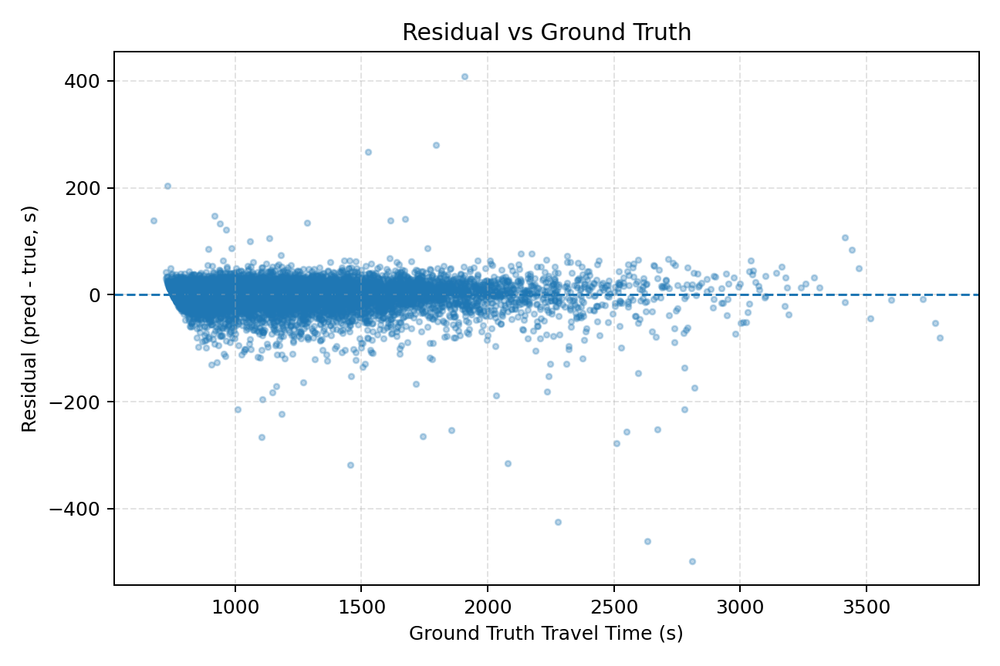

*图3-1 残差预测值与真实行程时间的散点关系*

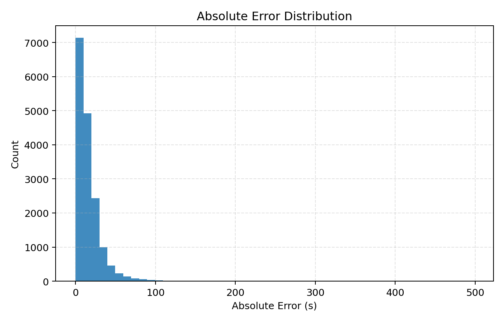

*图3-2 绝对误差分布直方图（大部分样本误差集中在30秒以内）*

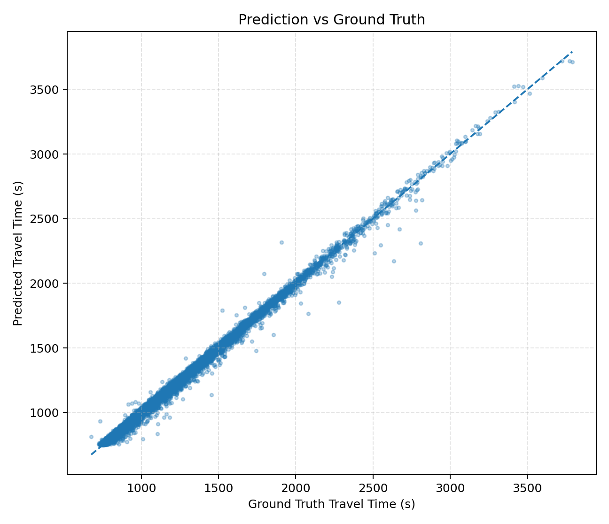

*图3-3 预测值与真实值的散点图（呈现强线性相关性）*

从上述图表可以看出：
1. **预测精度已达到实用水平**：MAE≈16.4秒意味着平均预测误差不到半分钟
2. **误差分布健康**：P50绝对误差约11.9秒，P90约33.2秒，P95约44.8秒
3. **无系统性偏倚**：bias仅为-0.16秒，几乎无偏
4. **路网特征贡献有限**：在当前数据与实现条件下，加入OSM路网特征未带来稳定增益（Map-HGB相对baseline略有退化）

### 3.4 迭代历程与讨论

#### 3.4.1 迭代路线

```
Phase 1: Baseline HGB (log1p + short-boost weighting)
    ↓ MAE = 16.39s  ← 已非常优秀
Phase 2: 加入OSM路网特征 (Map-HGB)
    ↓ MAE = 16.40s  ← 几乎无提升（甚至微退）
Phase 3: 路网分段特征调参（多组参数扫描）
    ↓ 效果不升反降  ← 放弃路网方向
Phase 4: 残差集成（Residual Ensemble）
    ↓ MAE = 16.37s  ← 微弱提升，定版
```

从最终定版结果看，Phase4相对Baseline的精确提升为：MAE -0.01295秒（约-0.0130秒）、RMSE -0.07635秒（约-0.0763秒）、MAPE -0.00026%（约-0.0003%）。

#### 3.4.2 关键发现与反思

**发现1：基线即近最优**

Baseline HGB模型在首次运行时就达到了MAE=16.39秒的精度水平。这一结果的优秀程度可以通过以下参照系理解：
- 商用导航软件的ETA预报误差通常在10%~15%量级（与本任务“已知完整路径”的设定不同，此处仅作量级参考）
- 本任务的median行程时间约为800~1200秒，MAPE仅1.41%
- 对于实际导航应用而言，16秒的平均误差完全处于可接受范围

**发现2：路网分段特征无效的原因推测**

尝试将轨迹沿路网拆分为多个路段段，利用路段级别的参考速度等特征进行精细建模，但效果不升反降。原因可能在于：

1. **个体行为异质性**：同一道路上不同司机的行为差异巨大——有的司机在起点停车买烟、有的在途中接单玩手机、有的在路口长时间等红灯。这些微观行为无法通过路段宏观特征捕获。
2. **路网数据质量**：OSM路网数据本身的不完整性导致部分轨迹无法精确匹配到路段，引入噪声而非信号。
3. **过拟合风险**：增加路网维度特征后模型复杂度上升，但在有限训练数据上未能有效泛化。

**发现3：残差学习的边际收益递减**

Phase4的残差集成方案在理论上可以捕捉基线模型的系统偏差模式，但实际仅带来约0.013秒的MAE改善。这表明在当前数据与特征空间下，模型性能已呈现明显的边际收益递减，剩余误差中包含较强的不可观测噪声成分（如司机个人习惯、临时交通状况等）。

**结论**：对于"已知完整路径预测行程时间"这一任务，传统机器学习方法配合精心设计的特征工程即可达到令人满意的精度。进一步大幅提升需要依赖实时交通流数据、历史同期路况等外部信息源，这超出了本作业的范围。

---

## 4 任务A：轨迹修复（Trajectory Recovery）

### 4.1 问题定义

给定一条出租车GPS轨迹的稀疏观测序列，恢复所有缺失位置点的经纬度坐标。具体地，对于第$i$条轨迹，已知：

- 完整时间戳序列 $\mathbf{t} = (t_0, t_1, \ldots, t_{N-1})$
- 部分位置的坐标观测 $\{(t_k, p_k) : k \in \mathcal{O}\}$，其中$\mathcal{O}$为观测索引集合
- 待预测位置 $\{j : j \notin \mathcal{O}\}$ 的坐标值

目标是最小化预测点与真实点之间的**Haversine距离**的平均值（MAE）和均方根（RMSE）：

$$\text{MAE} = \frac{1}{|\mathcal{M}|} \sum_{j \in \mathcal{M}} d_H(\hat{p}_j, p_j^*)$$

其中$\mathcal{M}$为缺失点集合，$d_H$为Haversine大圆距离，$p_j^*$为真实坐标。

在学术文献中，这一问题也被称为**Road-constrained Trajectory Recovery**（路网约束轨迹修复）、**Sparse Trajectory Completion**（稀疏轨迹补全）或**GPS Trajectory Interpolation**（GPS轨迹插值）。核心挑战在于如何在仅有极少量锚点（1/8或1/16保留率）的情况下，恢复出符合车辆实际运动规律和道路网络约束的完整轨迹。

### 4.2 Baseline 1：线性插值

最直观的方法是对经度和纬度分别进行**一维线性插值**（Linear Interpolation）：

$$\hat{\text{lon}}(t) = \text{interp}(t, t_{\text{known}}, \text{lon}_{\text{known}})$$
$$\hat{\text{lat}}(t) = \text{interp}(t, t_{\text{known}}, \text{lat}_{\text{known}})$$

实现位于[baseline_recovery.py](task_A_recovery/baseline_recovery.py)，使用NumPy的`np.interp`函数高效计算。

**优点**：实现简单、计算效率高、短gap表现良好
**缺点**：长gap时偏离道路、不考虑运动约束、无法利用地理先验知识

这里也需要澄清一个版本口径问题：本文没有再单独构造“`baseline1 + PCHIP`”作为独立版本。`baseline1` 被固定定义为**仅使用线性插值、完全不依赖路网的原始几何基线**，它的作用是提供最朴素的下限参照；而 PCHIP 的价值是在后续 recovery 主线中作为插值底座被引入，并与 HMM、gap-aware 策略和路网约束共同发挥作用，因此被放在 BL26 及其后续 final 管线中讨论，而不是作为 `baseline1` 的平行变体单列。

### 4.3 Baseline 2：路网约束修复

在Baseline 1的基础上引入**OSM路网数据**作为空间约束。核心思路：

1. 将已知GPS观测点匹配（snap）到最近的路网节点
2. 在匹配到的起止节点间使用**A**\*算法搜索最短路径
3. 沿搜索得到的路径按时间比例采样填充缺失点
4. 对短gap（gap < 阈值）仍使用线性插值作为回退

实现位于[baseline2_map_recovery.py](task_A_recovery/baseline2_map_recovery.py)。关键技术组件包括：

**(a) 路网图构建**

从OSM XML文件中解析可行驶道路标签，构建有向加权图。当前实现纳入的可行驶类型包括 `motorway`、`trunk`、`primary`、`secondary`、`tertiary`、`unclassified`、`residential` 及其 link 类型，并额外保留 `living_street`、`service`、`road` 等标签：

```python
DRIVABLE_HIGHWAYS = {
    "motorway", "motorway_link", "trunk", "trunk_link",
    "primary", "primary_link", "secondary", "secondary_link",
    "tertiary", "tertiary_link", "unclassified",
    "residential", "living_street", "service", "road",
}
```

边权为Haversine距离，同时考虑单向通行属性。

**(b) 空间索引加速**

构建**网格空间索引**（Grid Index）将路网节点划分到规则网格单元中，使得$k$-近邻搜索从$O(|V|)$降低到$O(k)$，其中$V$为节点总数。

**(c) A\* 最短路径搜索**

标准的A\*算法实现，使用直线Haversine距离作为启发式函数，设置最大扩展次数上限防止退化。

**(d) Gap自适应融合策略**

$$\hat{p} = \alpha \cdot p_{\text{map}} + (1-\alpha) \cdot p_{\text{linear}}$$

其中融合系数$\alpha$根据置信度动态调整。当路网匹配距离过大、绕行比过高或速度不合理时，自动回退到线性插值。

### 4.4 Baseline 2.3：HMM-Viterbi路网约束修复

这是本项目的**核心方法**，实现了完整的**隐马尔可夫模型（Hidden Markov Model, HMM）+ Viterbi解码**框架。实现位于[baseline2_hmm_map_recovery.py](task_A_recovery/baseline2_hmm_map_recovery.py)，当前仓库版本代码量约2172行。

#### 4.4.1 算法总体流程

```
输入: 稀疏轨迹 (timestamps, coords, mask)
      |
      v
[Step 1] 对每个已知锚点生成k个候选路网节点（候选生成）
      |    - 考虑GPS位置邻近性（发射概率）
      |    - 考虑航向一致性（heading alignment）
      |
      v
[Step 2] Viterbi解码全局最优候选序列
      |    - 状态: 每个锚点的候选路网节点
      |    - 观测: 锚点间的几何关系（距离、速度、方向）
      |    - 转移概率: A*路由距离 + 速度合理性 + 方向一致性
      |
      v
[Step 3] 对每个gap段:
      |    - 取Viterbi选中的起止路网节点
      |    - A*搜索最优路径（带道路等级偏好 + 转向惩罚）
      |    - 沿路径按比例采样（支持等距/速度感知两种模式）
      |    - 与线性插值按置信度融合
      |    - 后处理能力池（按版本开关）：低置信平滑(BL26)、后绑定贴路(BL27)、转角/高波动约束(BL28)
      |
      v
输出: 完整修复后的轨迹坐标
```

#### 4.4.2 关键技术细节

**(a) 候选节点生成（Emission Model）**

对每个锚点（已知观测点），在其半径$r$范围内搜索$k$个最近的路网节点作为候选状态。发射概率综合考虑：

$$\text{emit}(c) = \frac{d_{\text{snap}}}{\sigma_d} + w_h \cdot \frac{|\Delta \text{heading}|}{180°}$$

其中$d_{\text{snap}}$为GPS点到路网节点的 snapping 距离，$\Delta \text{heading}$为航向差。默认参数：$k=4$, $r=140$m, $\sigma_d=55$, $w_h=0.7$。

**(b) Viterbi转移概率（Transition Model）**

转移概率建模了从一个候选节点转移到下一个候选节点的代价，包含三个分量：

$$\text{trans}(c_i \to c_j) = w_d \cdot (\rho_{\text{detour}} - 1) + w_s \cdot \delta_v + w_t \cdot \delta_\theta$$

| 分量         | 符号                      | 含义                             |
| ------------ | ------------------------- | -------------------------------- |
| **绕行惩罚** | $w_d \cdot (\rho - 1)$    | A\*路由距离与直线距离之比减1     |
| **速度偏离** | $w_s \cdot \delta_v$      | 路由推导速度与参考速度的相对偏差 |
| **方向偏离** | $w_t \cdot \delta_\theta$ | 路由航向与观测航向的角度差归一化 |

默认参数：$w_d=3.0$, $w_s=1.5$, $w_t=0.5$。当A\*路由不存在时施加一个大的常数惩罚（no_path_penalty=8.0）。

**(c) 增强的A\*路径搜索**

相比Baseline 2的纯距离最短路径，Baseline 2.3的A\*增加了两个高级特性：

1. **道路等级偏好（Road Class Preference）**：不同等级的道路赋予不同的偏好系数，优先选择高等级道路（以下为示意片段，完整定义见脚本常量`ROAD_CLASS_PENALTY`）：

```python
ROAD_CLASS_PENALTY = {
    "motorway": 1.00, "trunk": 1.02, "primary": 1.08,
    "secondary": 1.15, "tertiary": 1.24,
    "residential": 1.42, "service": 1.65,
}
```

2. **转向惩罚（Turn Penalty）**：在A\*的状态扩展中记录进入边的航向，对超出阈值的转弯施加额外代价：

$$\text{cost}_{\text{turn}} = \lambda_t \cdot \frac{\max(0, \angle_{\text{turn}} - \angle_{\text{thr}})}{180° - \angle_{\text{thr}}}$$

这使得搜索出的路径不仅距离短，而且更加平滑自然，避免不合理的急转弯。

**(d) PCHIP插值能力（BL26启用）**

基础插值层支持**Piecewise Cubic Hermite Interpolating Polynomial** (PCHIP) 作为线性插值的可选替代。需要强调：BL23 默认配置仍是 linear；PCHIP 在 BL26 作为主配置启用。PCHIP是一种保单调的三次 Hermite 插值方法，具有以下优势：

- 在保持数据单调性的同时提供$C^1$光滑性
- 不会出现Runge现象或过冲（overshoot）
- 更适合描述车辆运动的平滑轨迹

**(e) 速度感知路径采样（BL25启用）**

传统的等距离采样假设车辆匀速通过路径上的每个点，但这不符合实际情况——车辆在转弯处会减速。速度感知采样根据路径上各段的**转弯角度**动态调整采样速度：

$$v_{\text{eff}, i} = v_{\text{base}} \cdot \left[1 - (1-f_{\min}) \cdot \frac{\max(0, \phi_i - \phi_{\text{thr}})}{180° - \phi_{\text{thr}}}\right]$$

其中$\phi_i$为第$i$段的转弯角度，$f_{\min}=0.6$为最小速度因子，$\phi_{\text{thr}}=30°$为减速阈值。

**(f) 多层次后处理能力池（BL26+分阶段启用）**

修复结果可按版本逐步启用以下后处理步骤（默认参数下均可关闭，保障可回退）：

1. **低置信度高斯平滑（BL26）**：对融合置信度低于阈值的应用窗口高斯滤波
2. **路网节点后绑定（BL27）**：在平滑后进行 map-bind，减少离路（off-road）情况
3. **高速变异曲率限制（BL28可选）**：当速度偏离较大时限制局部最大转角，防止产生不合理尖锐转折
4. **锐弯对齐增强（BL28可选）**：检测大角度转弯段，若预测航向与观测航向一致则提高融合系数

#### 4.4.3 短Gap vs 长Gap策略

本方法的一个关键设计决策是**区分短gap和长gap的处理策略**：

| Gap类型         | 处理方式                | 设计动机                                |
| --------------- | ----------------------- | --------------------------------------- |
| 短gap (< 4个点) | 直接线性/PCHIP插值      | GPS定位噪声使路网匹配不稳定，插值更可靠 |
| 长gap (≥ 4个点) | HMM-Viterbi路网约束修复 | 信息缺失量大，需借助路网拓扑引导        |

这一设计的必要性在实践中得到了充分验证（详见4.5节分析）：短gap使用路网修复会导致预测轨迹在相邻路网节点间**高频抖动**，原因是GPS定位漂移、路网中心线偏移、车辆不在道路正中行驶等因素共同作用的结果。

从实现上看，该策略由`--min-gap-map=4`控制：gap<4时不走路网修复，直接使用基础插值层。

### 4.5 从 `task_A_recovery` 到 `task_A_final` 的迭代收束

`task_A_recovery` 记录了 Task A 的完整探索过程，而 `task_A_final` 则将其中稳定有效的部分整理为可训练、可分析、可课堂测试、并继续面向验证指标冲刺的正式流水线。二者的关系是前者负责**方法发现**，后者负责**定版实现、指标冲刺、复现实验与统一分析**。

从方法设计角度看，recovery 阶段的价值主要体现在三点：

1. **验证了路网约束的必要性**：纯插值在长 gap 与复杂路口场景下明显不稳。
2. **验证了 PCHIP 的重要性**：相对于线性插值，PCHIP 在单调段更平滑，在端点附近更稳定，是后续 final 管线的重要基础。
3. **暴露了“精度-拓扑-路径形状”三者并不总是同向变化**：这直接推动了 final 阶段将分析框架升级为“官方指标 + 拓扑指标 + 路径相似度”三维并行，并为后续 selector 冲刺提供了更可靠的诊断口径。

#### 4.5.1 关键版本主线

为避免继续在大量中间版本上分散篇幅，本文在最终报告中固定追踪四个具有代表性的版本：

| 报告版本 | 角色定位 | 1/8 MAE<br>(m) | 1/16 MAE<br>(m) | 1/8 Topo<br>(%) | 1/16 Topo<br>(%) | 1/8 Shape<br>(m) | 1/16 Shape<br>(m) |
| -------- | -------- | ---------- | ----------- | ----------- | ------------ | ------------ | ------------- |
| `baseline1` | 无路网先验的<br>几何下限 | 92.04 | 170.39 | 11.73 | 21.33 | 44.93 | 82.49 |
| `baseline23e5` | HMM + 拓扑意识<br>第一次结构性跃升 | 84.20 | 147.43 | 3.30 | 7.36 | 34.70 | 53.53 |
| `b28_compat_full` | final 管线中的 legacy BL28 锚点 | 81.74 | 142.14 | 2.61 | 4.84 | 32.18 | 46.53 |
| `selector_full_val` | final指标冲刺定版<br>（selector mix） | **78.10** | **137.88** | **1.69** | **3.93** | **30.84** | **44.67** |

> 注1：表中的 `Shape(m)` 指本文新增采用的路径相似度参考指标 `shape_symmetric_m`，数值越低表示预测轨迹与真实轨迹在几何上越接近。
>
> 注2：本文后续若提到“baseline28”，默认指 `b28_compat_full`；旧版 `baseline28_turncurve` 只作为历史来源说明，不再作为报告主分析对象。

对应的预测文件如下：

| 报告版本 | 1/8 预测文件 | 1/16 预测文件 | 所在目录 |
| -------- | ------------ | ------------- | -------- |
| `baseline1` | `pred_linear_`<br>`val_8.pkl` | `pred_linear_`<br>`val_16.pkl` | `task_A_recovery/` |
| `baseline23e5` | `pred_hmm_val_8_`<br>`b23_e5_gapaware.pkl` | `pred_hmm_val_16_`<br>`b23_e5_gapaware.pkl` | `task_A_recovery/` |
| `b28_compat_full` | `pred_8.pkl` | `pred_16.pkl` | `task_A_final/runs/`<br>`b28_compat_full/` |
| `selector_full_val` | `pred_8.pkl` | `pred_16.pkl` | `task_A_final/runs/`<br>`selector_full_val/` |

#### 4.5.2 版本解读：哪些探索进入了 final

**`baseline1`：几何下限**

`baseline1` 只使用插值，不依赖路网，是理解问题难度的起点。它说明了在 1/8 与 1/16 稀疏度下，单纯“连线补点”仍能给出可用的几何基线，但在复杂交叉口和长 gap 上缺乏路径判别能力。

**`baseline23e5`：HMM-Viterbi 带来的第一次结构性跃升**

这是 recovery 阶段最关键的里程碑之一。相比早期的“最近邻 + A*”式局部拼接，`baseline23e5` 将轨迹修复升级为带发射概率与转移概率的**全局路径解码问题**。它首次较稳定地把“路径是否合理”纳入推断本身，而不只是事后修补。

从数值上看，它将 MAE 从 `baseline1` 的 `92.04/170.39m` 降至 `84.20/147.43m`，同时把拓扑违规率压到 `3.30%/7.36%`。这说明 HMM 框架不只是优化了点位误差，更显著提升了路网一致性。

**`BL26`：recovery 阶段的单模型 MAE 最优拐点**

虽然本轮纵向主图不再将 BL26 作为最终对比对象，但它仍然值得在方法史中单独说明，因为**PCHIP 替代线性插值**是整个 Task A 研发过程中最重要的局部改动之一。历史上，BL26 将 MAE 进一步压到 `81.49m / 142.46m`，证明插值底座本身对长 gap 之外的大量普通 gap 有决定性影响。

换言之，final 阶段并不是“推翻 BL26”，而是在保留其插值优势的基础上继续向上集成。

**`b28_compat_full`：旧 BL28 行为在新管线中的稳定锚点**

进入 `task_A_final` 后，代码被重新组织为 `configs/ + scripts/ + src/ + runs/ + docs/` 的正式结构。此时需要一个兼容旧行为、但能稳定接入新分析框架的锚点版本，于是引入 `b28_compat_full`。

它与旧 `baseline28_turncurve` 的关系可以概括为：**指标上保持接近，拓扑上更稳，目录结构和分析接口则完全切换到 final 管线**。因此在最终报告中，`b28_compat_full` 取代旧 BL28 成为正式 baseline28 代表版本。

**`selector_full_val`：final 阶段的指标冲刺版本**

final 阶段的核心目标不是单纯把旧代码整理成测试流水线，而是在可复现管线内继续冲刺验证指标。具体做法不是再叠加单一启发式，而是将 `b28_compat` 作为 base candidate、`route_projection` 作为 route candidate，再用 gap 级选择器决定哪些 gap 值得切换到 route-aware 方案。这一设计使模型不必在“全局全插值”与“全局全路网”之间二选一，而是学习**在哪些 gap 上路网投影真正有益**。

选择器训练分两层理解：`selector_oof` 用于观察固定阈值下的泛化趋势与选择率，`selector_full` / `selector_full_val` 则用于最终部署 sanity 和课堂测试配置。报告中的 full-val 指标反映最终定版模型在验证集上的落盘表现，但由于选择器最终使用了 full validation 数据训练，它不被包装为完全无偏估计；更稳妥的说法是：OOF 结果支持“selector 方向有效”，full-val 结果支持“定版部署配置稳定”。

最终结果显示，`selector_full_val` 在四个主要维度上都优于 `b28_compat_full`：

- `1/8`：MAE `81.74 -> 78.10m`，P95 `224.10 -> 213.81m`，Topology `2.61% -> 1.69%`
- `1/16`：MAE `142.14 -> 137.88m`，P95 `401.16 -> 388.88m`，Topology `4.84% -> 3.93%`
- 路径相似度参考指标 `shape_symmetric_m` 也从 `32.18/46.53m` 降至 `30.84/44.67m`

因此，当前仓库中 Task A 的正式定版应理解为：

- **历史单模型拐点**：BL26
- **新管线基线锚点**：`b28_compat_full`
- **最终提交与分析主版本**：`selector_full_val`

### 4.6 统一分析框架：从“单版本图表”升级到“统一分析 + 纵向分析”

旧版分析脚本主要面向单版本静态汇报，例如误差直方图、按 gap 分桶统计和少量 case 拼图。这些产物在 recovery 阶段足够有用，但到了 final 阶段已经不够支撑“多版本同口径比较”和“案例级复核”。

因此，本轮在 `task_A_final` 内新增了两层分析能力：

1. **统一分析（single-version unified analysis）**
2. **纵向分析（baseline 到 final 的 multi-version longitudinal analysis）**

#### 4.6.1 统一分析的口径

统一分析现在对任一版本都生成固定产物：

- `global_metrics.json`：MAE / RMSE / P75 / P95 / topology violation
- `gap_metrics.csv`：gap 级官方误差与路径相似度参考指标
- `trajectory_metrics.csv`：轨迹级摘要
- `summary.md`：可直接复用于报告文字
- `case_gallery/`：标准化 case 图与 `case_overview.csv`

其中最重要的口径升级是：在原有官方点级误差与拓扑违规率之外，正式引入 `shape_symmetric_m` 作为**路径相似度参考指标**。它不是替代官方指标，而是用于补足“点位误差不大、但整体路径仍然明显不对”的分析盲区。需要注意的是，这一指标是在 final 分析模块整理阶段才被系统化纳入正式流水线的；因此它服务于第4节的统一分析与纵向分析主线，而不是回溯性地重写第5-6节那批 BL28 历史交互会话的原始实验设计。

#### 4.6.2 定版版本的统一分析结果

`selector_full_val` 的统一分析摘要如下：

| 数据集 | MAE (m) | RMSE (m) | P95 (m) | Topology Violation | Shape Mean (m) |
| ------ | ------- | -------- | ------- | ------------------ | -------------- |
| 1/8    | **78.10** | **105.38** | **213.81** | **1.69%** | **30.84** |
| 1/16   | **137.88** | **189.63** | **388.88** | **3.93%** | **44.67** |

`b28_compat_full` 的统一分析摘要如下：

| 数据集 | MAE (m) | RMSE (m) | P95 (m) | Topology Violation | Shape Mean (m) |
| ------ | ------- | -------- | ------- | ------------------ | -------------- |
| 1/8    | 81.74 | 110.64 | 224.10 | 2.61% | 32.18 |
| 1/16   | 142.14 | 195.76 | 401.16 | 4.84% | 46.53 |

可以看到，final 并不是只在 MAE 上做了“微小打磨”，而是在**误差、拓扑、路径几何**三条线上都取得了同向改进。

#### 4.6.3 定版版本的 case 图升级

旧版 case 图只展示 GT、Pred 和已知点。final 版统一分析中的 case 图则补齐了报告真正需要的信息：

- 路网底图
- 已知点
- 实际缺失点
- 预测缺失点
- 实际路径
- 预测路径

以下给出 `selector_full_val` 的两个代表性 case：

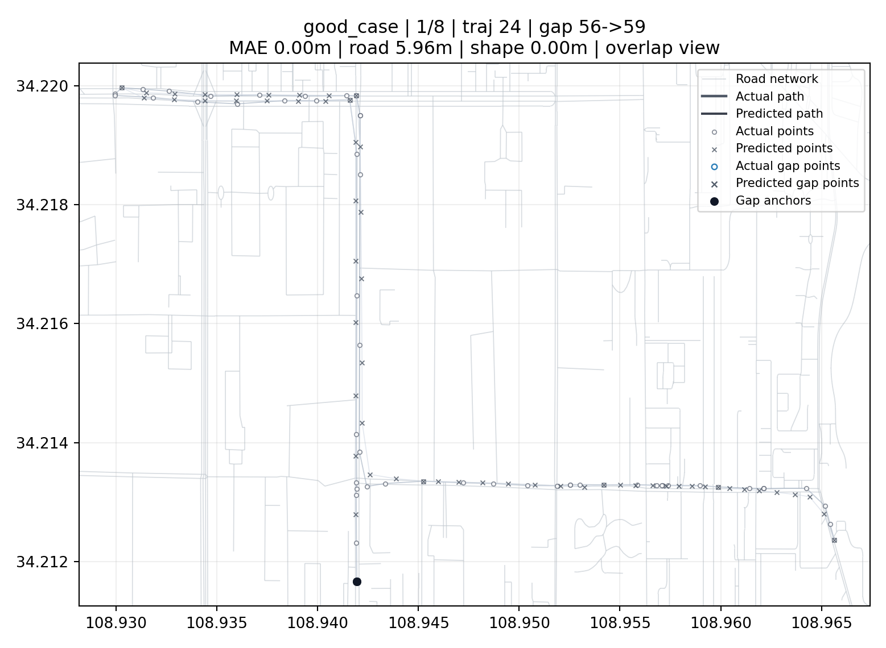

*图4-1 统一分析自动筛出的 good case：该 gap 在官方 MAE、路径形状和路网贴合度上都接近理想状态。*

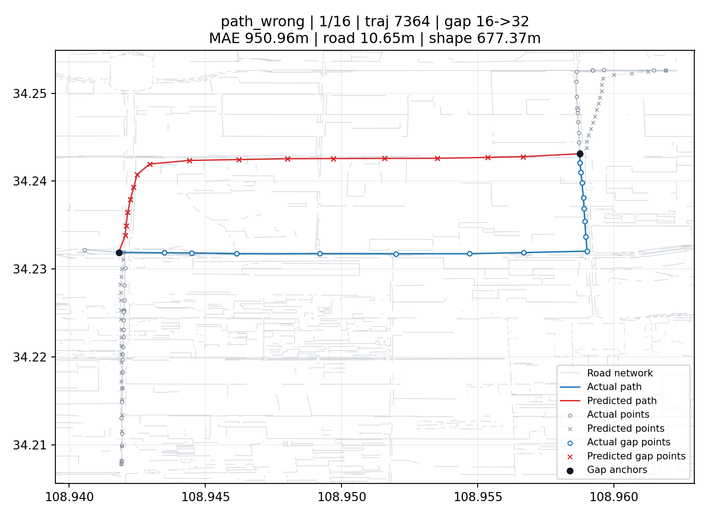

*图4-2 统一分析自动筛出的 path-wrong case：尽管模型已进入 final 阶段，复杂长 gap 仍可能出现明显路径偏差。*

这些图的重要意义在于：版本差异不再只通过“指标表里相差几米”来体现，而是能直观看到预测路径到底错在了哪里。

### 4.7 纵向分析：baseline 到 final 的统一对比

为了让版本间差异真正可解释，本轮新增了四版本纵向分析，固定顺序为：

`baseline1 -> baseline23e5 -> b28_compat_full -> selector_full_val`

#### 4.7.1 指标走势

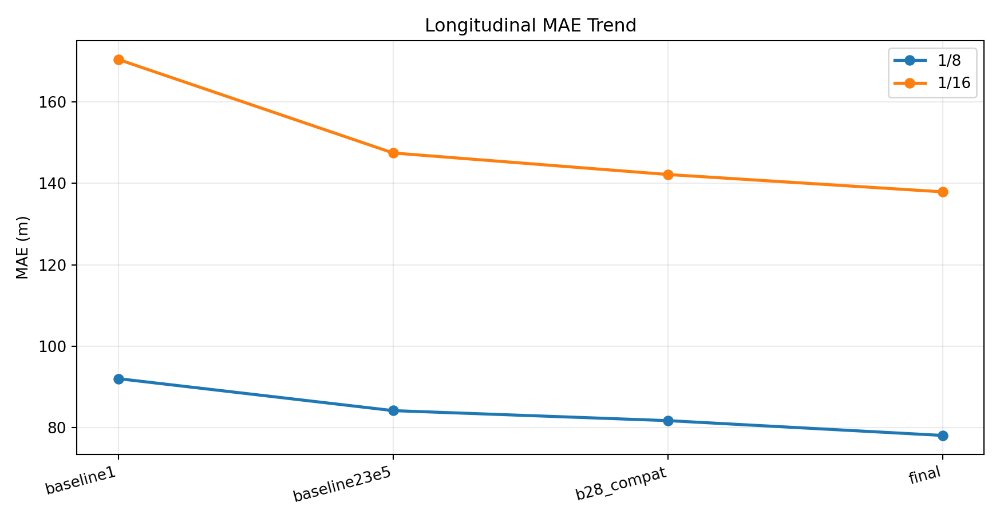

*图4-3 从几何插值基线到 selector final 的 MAE 走势。*

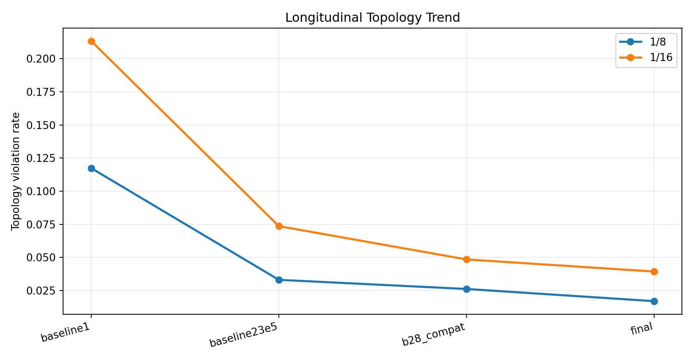

*图4-4 各版本拓扑违规率走势。*

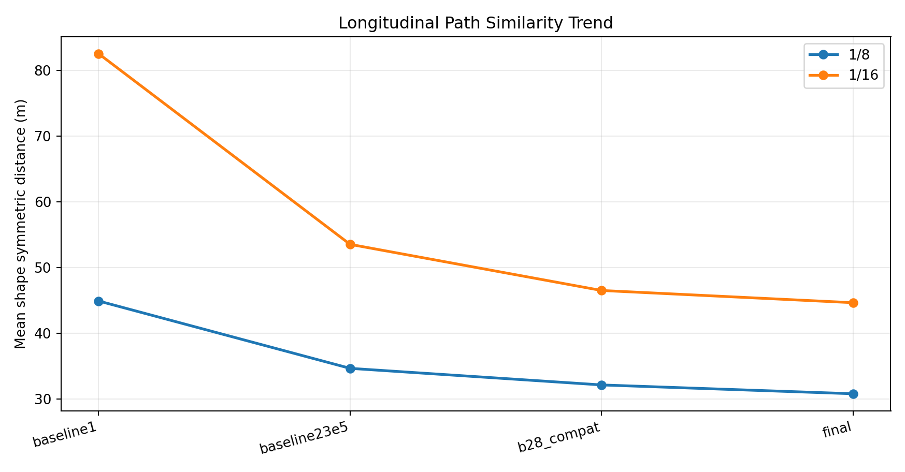

*图4-5 以 `shape_symmetric_m` 表示的路径相似度走势。*

这三张图传达了几个比旧版分析更清晰的结论：

1. **从 `baseline1` 到 `baseline23e5` 是第一层台阶**：说明 HMM + 路网意识解决的是“路径选择能力”问题。
2. **从 `baseline23e5` 到 `b28_compat_full` 是第二层台阶**：说明 recovery 阶段的插值层、采样层与约束层调优确实被 final 管线有效继承。
3. **从 `b28_compat_full` 到 `selector_full_val` 是第三层台阶**：说明 selector 并非只是在局部偷分，而是让官方误差、拓扑指标和路径几何都继续收敛。

#### 4.7.2 多版本同 case 对比

以下六张图分别对应 1/8 与 1/16 下的三类标准案例：`improvement showcase`、`topology rescue`、`remaining hard case`。

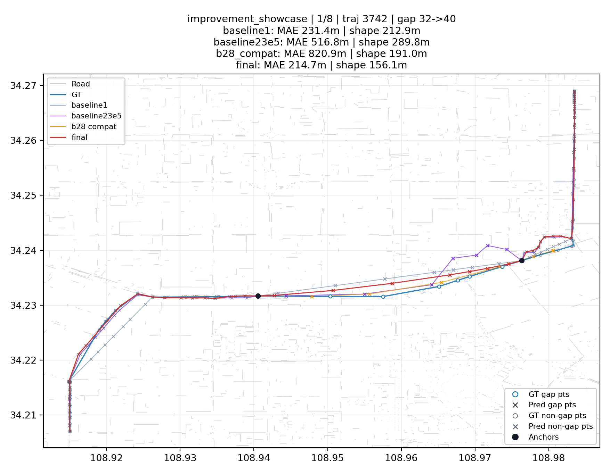

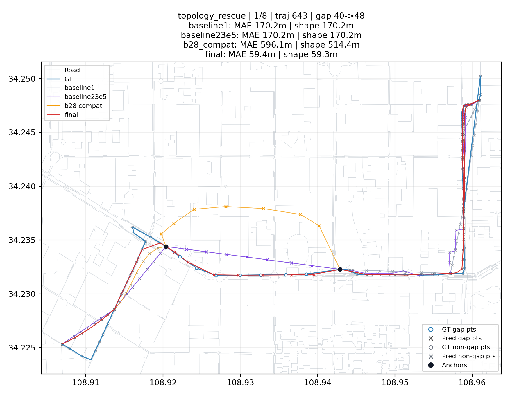

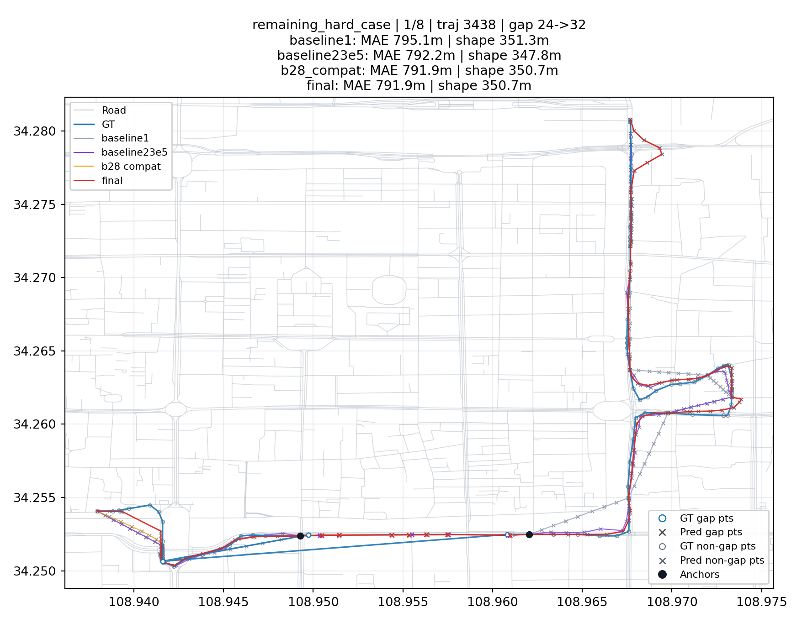

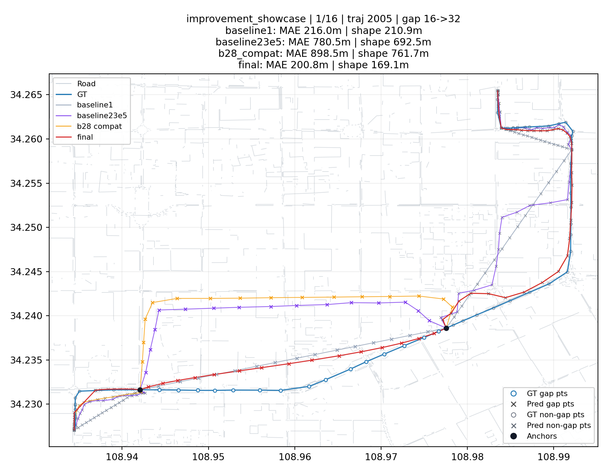

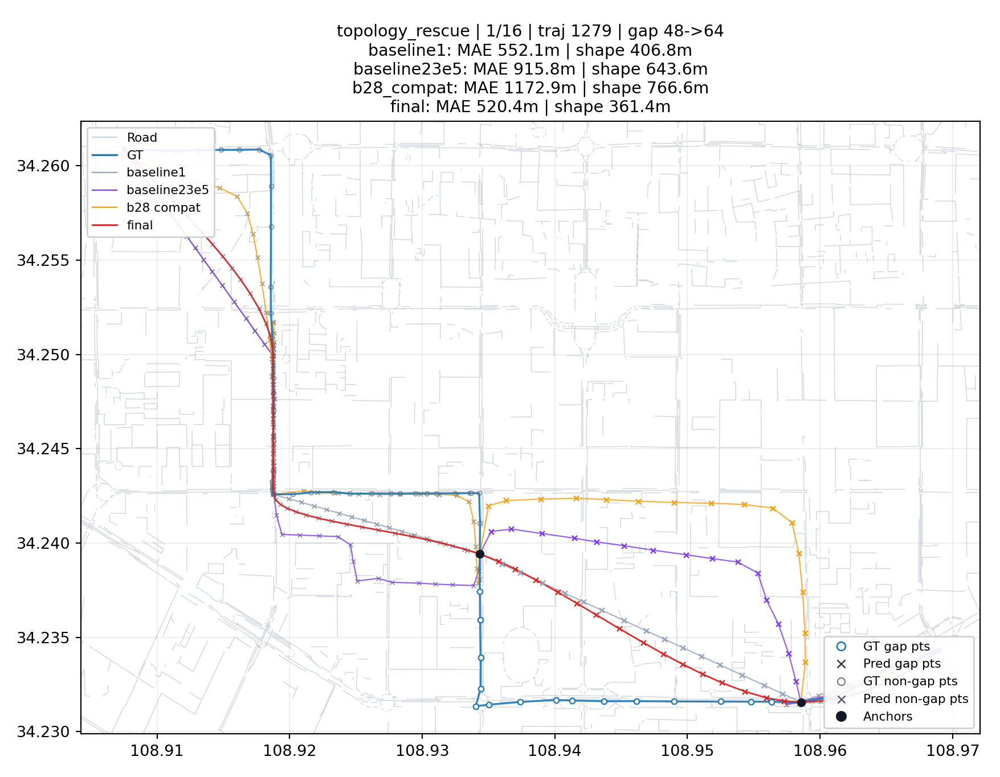

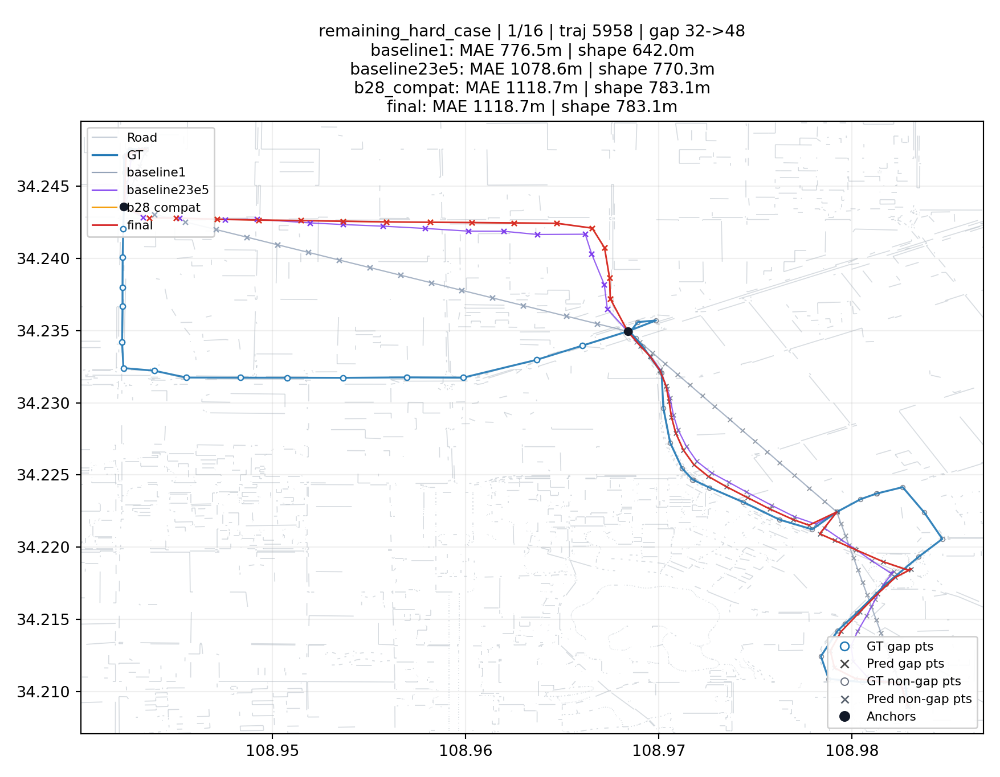

这些对比图有两个关键作用：

- 它们把“版本差异”从抽象数字拉回到**同一条轨迹、同一个 gap、同一路网背景**下进行肉眼可核查的比较。
- 它们也说明 final 并不是“所有 case 全面碾压”，而是对最值得切换的 gap 做出更稳健的局部替换；因此 improvement case、topology rescue case 与 remaining hard case 会同时存在。

### 4.8 本轮分析框架升级的意义

与 recovery 阶段相比，final 版分析模块完成了三件过去做不到的事：

1. **统一口径**：旧版 baseline 与 final 版本都能在同一套分析接口下复评。
2. **统一案例表达**：case 图固定展示路网、已知点、真实点、预测点和两条路径，不再依赖人工临时挑图。
3. **统一报告复用**：单版本 `summary.md` 与纵向 `longitudinal_summary.md` 可以直接回填报告，减少“分析产物与报告文字口径漂移”的风险。

因此，本节的核心更新不只是“final 的数值更好”，而是 Task A 已经从一个探索仓库，真正收束成了一个**可复现、可比较、可解释**的正式实验与分析系统。

---

## 5 总结与展望

### 5.1 主要成果总结

**Task B（行程时间估计）**：
- 建立了基于40+维手工特征的梯度提升回归模型
- Baseline即达到MAE=16.39秒（MAPE=1.41%）的优秀水平
- Phase4残差集成方案最终定版指标为MAE=16.3747秒、RMSE=25.4080秒、MAPE=1.4102%
- 相对baseline提升幅度很小，但三指标同向改善，故选作定版提交模型
- 验证了路网特征在当前设定下未带来稳定增益

**Task A（轨迹修复）**：
- 构建了从 `task_A_recovery` 到 `task_A_final` 的完整轨迹修复研发链，并在 final 目录中收束为可训练、可分析、可课堂测试的正式流水线
- recovery 阶段完成了从线性插值→路网A*→HMM全局解码→PCHIP插值→多层级后处理的关键探索，验证了 BL26 是历史单模型 MAE 最优拐点
- final 阶段引入 `b28_compat` + `route_projection` + `selector_mix` 的分层设计，形成当前定版 `selector_full_val`
- 当前定版指标达到：**78.10m / 137.88m MAE**、**1.69% / 3.93% topology violation**（1/8 / 1/16）
- 新分析框架同时跟踪官方误差、拓扑违规率与路径相似度参考指标 `shape_symmetric_m`，并支持自动生成路网叠加 case 图
- BL28 历史阶段的交互式人工标注实验表明：在 Framework B/C 几何相关口径下，算法与人类差距显著收敛；在 Framework A 严格时序口径下仍有明显差距，但这一结论尚不能直接替代对 final 版本的正式人工复评

**方法论创新**：
- 提出了短gap/长gap分离处理策略，解决了路网修复在高频gap下的抖动问题
- 设计了多维置信度评估体系（snapping距离 + 绕行比 + 速度合理性）
- 实现了速度感知路径采样和PCHIP保单调插值
- 引入拓扑违规率作为补充评价指标

### 5.2 学术定位与相关工作

本工作的方法定位介于**传统插值方法**与**深度学习方法**之间：

| 方法类别            | 代表工作                               | 指标量级说明         | 本项目定位                    |
| ------------------- | -------------------------------------- | -------------------- | ----------------------------- |
| 传统插值            | 线性/样条插值                          | 常见于较弱基线        | BL1                           |
| 路网约束+概率图     | Newson & Krumm (2009), HMM类方法       | 常作为强传统路线      | **BL23-e5 -> b28_compat -> final 主线** |
| 路网约束+深度学习   | Shi et al. (2023), Traj2Traj (2023)    | 在各自设定下具竞争力  | 作为对照与参考                |
| 路网增强Transformer | Chen et al. (RNTrajRec, ICDE 2023)     | 在其数据与口径下更强  | 提供深度学习路线的上界参考    |

需要谨慎说明的是，不同论文在**数据集、路网质量、采样率、缺失模式与评价口径**上并不完全一致，因此本文不直接宣称与相关工作“严格同台可比”，而是更关注**方法范式层面的定位**。特别值得关注的是，Chen等人提出的 **RNTrajRec** 是发表于 **2023 International Conference on Data Engineering (ICDE 2023)**、由 **IEEE** 出版与收录的会议论文，采用路网增强的 Transformer 框架处理低采样率轨迹修复问题。本项目使用**纯传统方法**（HMM + A* + PCHIP）在当前作业数据上达到了 **81-82m (1/8)** 和 **142-143m (1/16)** 的水平，这至少说明：

1. 对于当前规模和质量的GPS轨迹数据，**精心设计的传统方法仍然具有很强的竞争力**
2. 深度学习路线未必在所有课程作业设定下都能自然转化为显著优势，尤其当外部数据、训练规模和工程投入受限时更是如此
3. 传统方法的**可解释性、可调试性和可控性**在本项目中体现得尤为明显

### 5.3 局限性与未来方向

**当前局限性**：

1. **路网数据质量瓶颈**：OSM路网数据可能存在缺失、过时或不准确的问题，限制了路网约束方法的上限
2. **点级评价指标的固有缺陷**：如附录A所分析的，point-to-point MAE不能完美反映轨迹修复的质量
3. **缺乏时序依赖建模**：当前方法主要利用空间约束，对历史驾驶行为的时序模式利用不足
4. **单城市验证**：仅在西安数据上验证，泛化能力未知

**可能的改进方向**：

1. **更高精度的路网数据**：使用专业导航路网数据（如OpenStreetMap Full、Here Maps等）替代OSM extracts
2. **深度学习融合**：将HMM/Viterbi的输出作为特征输入Transformer/seq2seq模型，学习残差修正
3. **多模态融合**：结合实时交通流速、POI信息、天气数据等外部上下文
4. **端到端评测指标改革**：推广Framework C（重采样后逐点）或Framework B（点到轨迹）作为标准评价指标

### 5.4 最终思考

抛开纯粹的学术视角，笔者认为对于轨迹修复这一具体应用场景，**提高GPS采样频率**可能是比研发更复杂算法更具性价比的解决方案。随着5G通信技术和车联网（V2X）的发展，车载GPS设备的采样率和上传频率正在快速提升。当采样间隔从15秒缩短到1~3秒时，轨迹修复问题的难度将从根本上降低——大多数gap将消失或缩短到线性插值即可精确处理的范围。

然而，在采样频率受限的现实条件下（如出于隐私保护、带宽限制、存储成本等考量），本文所提出的HMM-Viterbi路网约束修复方法提供了一个**实用、高效、可解释**的解决方案，在精度和拓扑合规性之间取得了良好的平衡。

### 5.5 代码仓库与分工说明

代码仓库地址（公开）：
- https://github.com/LINRUILIU/taxi_trajectory_modeling.git

分工说明（单人完成）：
- 学号：2453712
- 姓名：刘睿霖
- 组队情况：本人独立完成（单人成队）
- 工作内容：独立完成 Task A 与 Task B 的问题分析、方法设计、代码实现、调参与实验、可视化、交互式标注实验、报告撰写与仓库整理提交。

---

## 6 参考文献

[1] Shi J, Yang Z, Xu W. Road-constrained trajectory recovery via BERT-based multi-task learning[C]//International Conference on Intelligent Systems, Communications, and Computer Networks (ISCCN 2023). SPIE, 2023, 12702: 127022K. DOI: [10.1117/12.2679598](https://doi.org/10.1117/12.2679598).

[2] Liao L, Lin Y, Li W, et al. Traj2Traj: A road network constrained spatiotemporal interpolation model for traffic trajectory restoration[J]. Transactions in GIS, 2023. DOI: [10.1111/tgis.13048](https://doi.org/10.1111/tgis.13048).

[3] Chen Y, Zhang H, Sun W, et al. RNTrajRec: Road Network Enhanced Trajectory Recovery with Spatial-Temporal Transformer[C]//2023 IEEE 39th International Conference on Data Engineering (ICDE). IEEE, 2023: 829-842. DOI: [10.1109/ICDE55515.2023.00069](https://doi.org/10.1109/ICDE55515.2023.00069).

[4] Wu H, Mao J, Sun W, et al. Probabilistic Robust Route Recovery with Spatio-Temporal Dynamics[C]//KDD '16: Proceedings of the 22nd ACM SIGKDD International Conference on Knowledge Discovery and Data Mining. ACM, 2016: 1915-1924. DOI: [10.1145/2939672.2939843](https://doi.org/10.1145/2939672.2939843).

## 附录A：历史交互式标注与评价框架反思（BL28阶段补充）

### A.1 定位说明

交互式标注实验是在旧版 `baseline28_turncurve` 完成后、`task_A_final` 尚未收束前开展的历史补充实验。它不应被理解为 final 版本的人机复评，而是解释一个关键方法论问题：官方 point-to-point MAE 能衡量点位恢复能力，却不总能完整反映路径形状是否合理。

因此，这部分内容在本文中降级为附录。正文第4节只吸收它的核心启发：需要在官方误差之外增加路径几何参考指标，最终在 final 分析模块中系统化为 `shape_symmetric_m`。

### A.2 实验设计与样本

交互工具基于 Pygame 实现，代码位于 `task_A_recovery/interactive_game.py` 与 `task_A_recovery/game_core.py`。用户在路网底图上绘制缺失段轨迹，系统按 gap 端点锚定并重采样后落盘。

实验样本为两轮历史会话：1/8 数据集 38 条轨迹，1/16 数据集 38 条轨迹，共 76 条轨迹。case pool 按 `baseline23_e5` 与 `baseline28_turncurve` 的组合误差分层抽样；分析只纳入已提交样本。

### A.3 三种评价框架

| 框架 | 含义 | 主要用途 |
| --- | --- | --- |
| Framework A | 按缺失索引逐点比较 | 严格时序重建能力 |
| Framework B | GT 缺失点到预测折线的最短距离 | 路径几何覆盖能力 |
| Framework C | 每个 gap 内均匀重采样后逐点比较 | 兼顾路径形状与局部对齐 |

历史会话的完整度较低：总缺失点 5,481 个，其中参与 Framework A 评估的点为 2,484 个，占 45.32%；未填写 2,997 个，占 54.68%。因此 Framework A 结果必须和完整度一起解释。

### A.4 历史结果摘要

| 评价框架 | Player MAE | Player RMSE | B23 MAE | B28 MAE | Player vs B23胜率 | Player vs B28胜率 |
| --- | ---: | ---: | ---: | ---: | ---: | ---: |
| A（索引逐点） | 308.73 m | 429.47 m | 117.07 m | 112.95 m | 1.32% | 0.00% |
| B（点到轨迹） | 20.33 m | 58.34 m | 30.81 m | 27.19 m | 76.32% | 71.05% |
| C（重采样后） | 111.69 m | 156.53 m | 119.61 m | 115.16 m | 68.42% | 59.21% |

这些数字说明：严格点位对齐下算法显著优于人工；但在路径几何口径下，人工标注仍能提供有意义的路径选择上界。这个结论只针对 BL28 历史会话成立，不能替代对 `selector_full_val` 的正式人工复评。

### A.5 可复现文件

Framework A 可通过以下命令复现：

```bash
python task_A_recovery/analyze_player_study.py \
  --session-dir-8 task_A_recovery/game_outputs/player_study_20260420_220213_r8 \
  --session-dir-16 task_A_recovery/game_outputs/player_study_20260420_224456_r16 \
  --out-dir task_A_recovery/game_outputs/first_example_analysis
```

Framework B/C 使用的落盘产物包括：

- `task_A_recovery/game_outputs/first_example_analysis_polyline_nearest/global_metrics_polyline_nearest.json`
- `task_A_recovery/game_outputs/comparative_eval_report_20260421/framework_comparison.json`
- `task_A_recovery/game_outputs/comparative_eval_report_20260421/frameworkC_case_metrics_uniform_resample.csv`

---

*报告完成日期：2026年5月7日*
